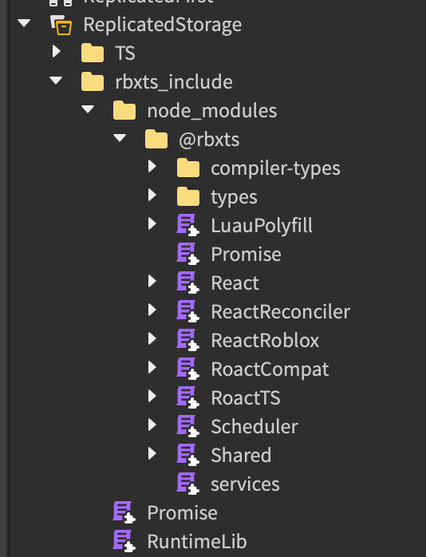

# [`@rbxts/react-ts`](https://www.npmjs.com/package/@rbxts/react-ts)

This package exports `react` and `roact-compat` for use in TypeScript projects.

To get this package working, it needs the `@rbxts/roact` alias so that the Roblox-TS JSX transformer can use this package instead of the default `roact` package.

## Installation

```bash
# recommended
npm install @rbxts/roact@npm:@rbxts/react-ts
yarn add @rbxts/roact@npm:@rbxts/react-ts

# may cause issues
pnpm add @rbxts/roact@npm:@rbxts/react-ts
```

Make sure the following alias or something similar is in your `package.json`:

```json
"dependencies": {
    "@rbxts/roact": "npm:@rbxts/react-ts",
}
```

## Compatibility

Installing this package will install React, ReactRoblox, etc. with the other packages under `@rbxts` in ReplicatedStorage. They may be accessed in Luau via `require(script.Parent...Parent.MODULE)` depending on your project structure.

<details>
    <summary>See explorer view</summary>
    
</details>

## Sources

Types are derived from [DefinitelyTyped](https://github.com/DefinitelyTyped/DefinitelyTyped/blob/master/types/react/v17/index.d.ts).

Dependencies of this package were published from [jsdotlua/react-lua](https://github.com/jsdotlua/react-lua).
